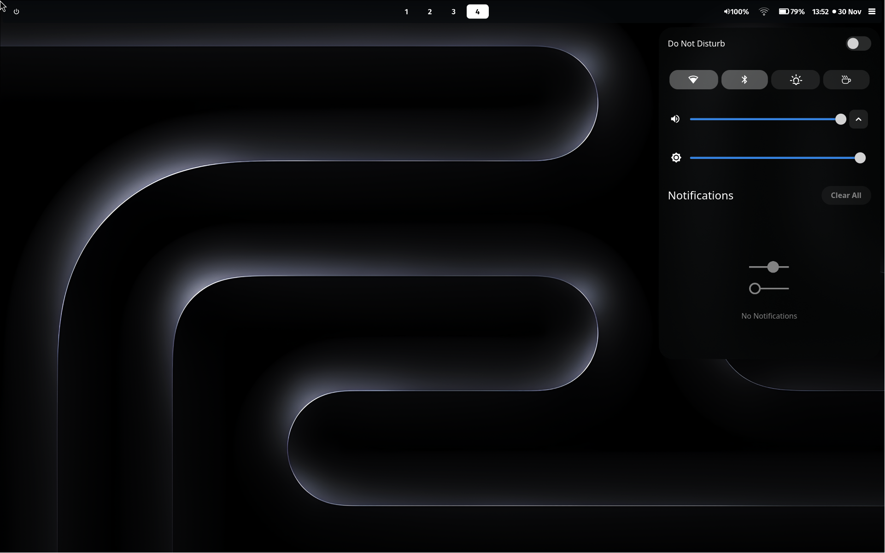
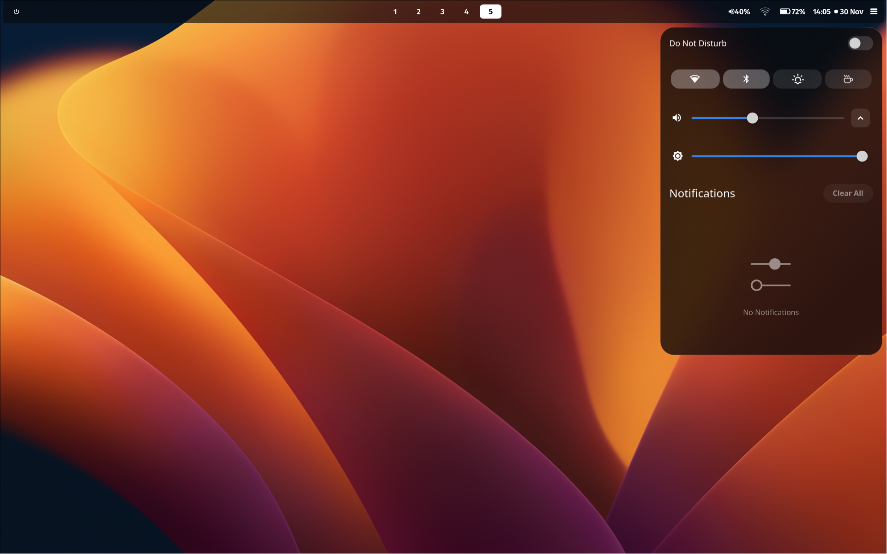
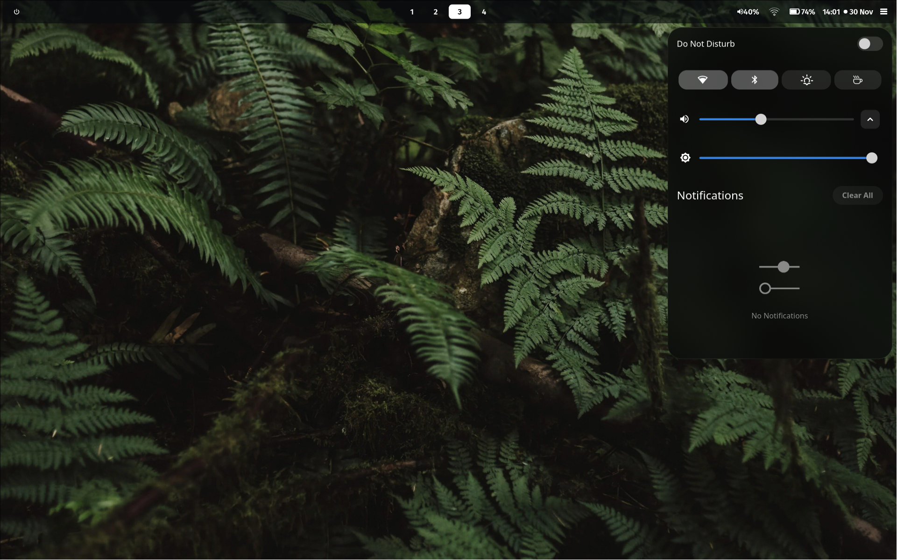
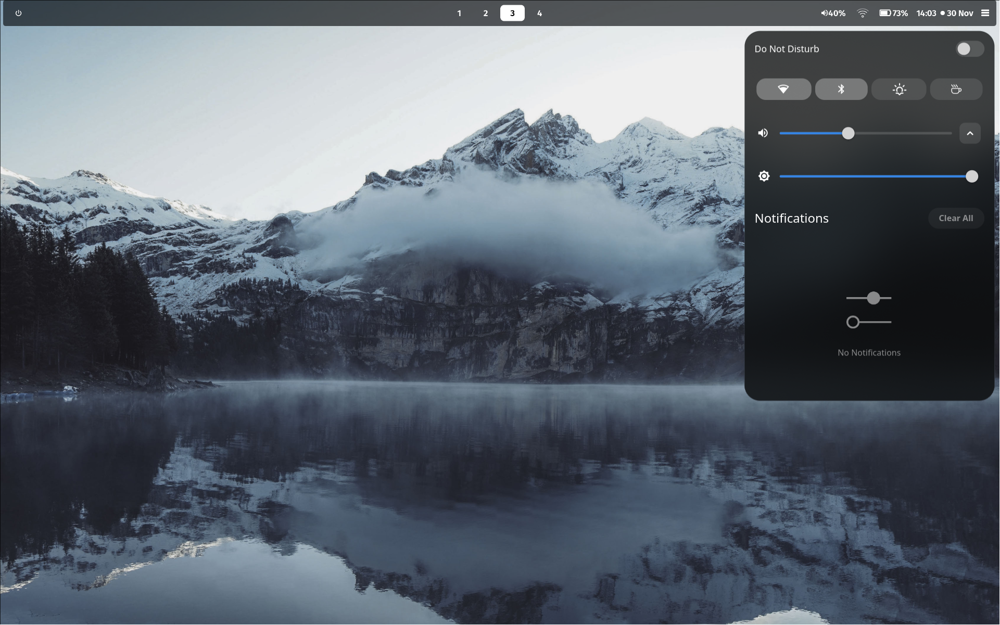
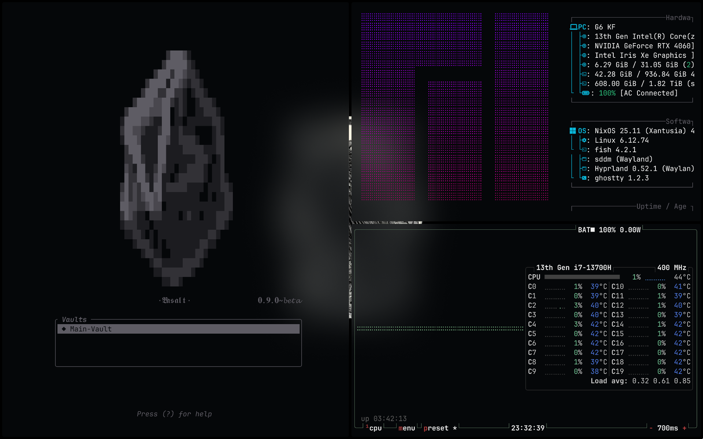
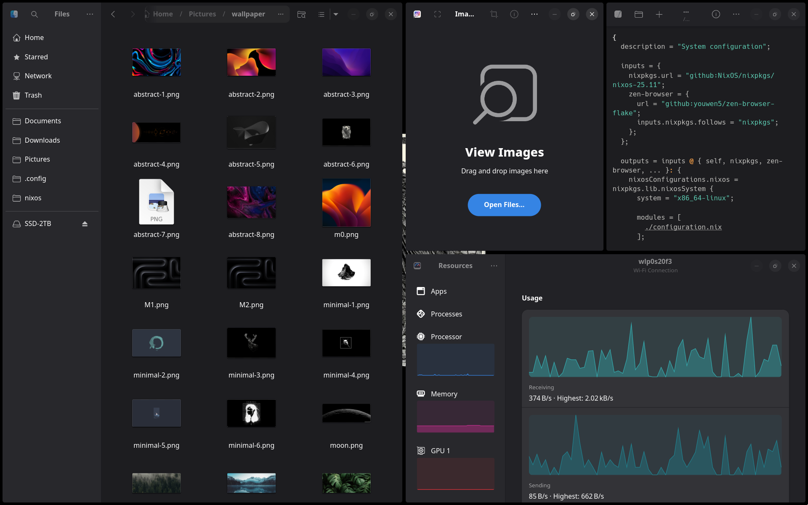

## Hyprland OSD

  
  
  
  

## Terminal First UI

  

## GTK-4 Design

  

---
A structured and reproducible Wayland-focused environment built around Hyprland, Neovim, and a collection of well-integrated TUI tools.
This repository defines my daily workspace: window management, development tooling, theming, and system behavior.

## System & Desktop Layer

#### Foundational components that shape the core desktop experience.

- Hyprland (Wayland compositor)
- Waybar (bar & module system)
- SwayNC (notifications)
- SwayOSD (OSD indicators)
- Hyprlock (lock screen)
- hyprdynamicmonitors (monitor configuration)
- Hyprsunset (screen warmth adjustment)
- SDDM (display manager)
- Rofi (launcher)
- Development & Terminal Layer

#### Tools that define the interactive and programming environment.

- Alacritty (terminal)
- Neovim (editor)
- NV-Chad (Neovim configuration distribution)
- ranger (file manager)
- bluetui (Bluetooth TUI)
- Btop (system monitor)
- fastfetch (system info)
- cava (audio visualizer)
- Theming & Visual Integration
- UI consistency across Wayland, Qt, and GTK applications.
- GTK theming
- QT6 theming
- SDDM theme

Credits & Related Work

Upstream projects and external configurations that inform or complement this setup.
(link to related GitHub project)
